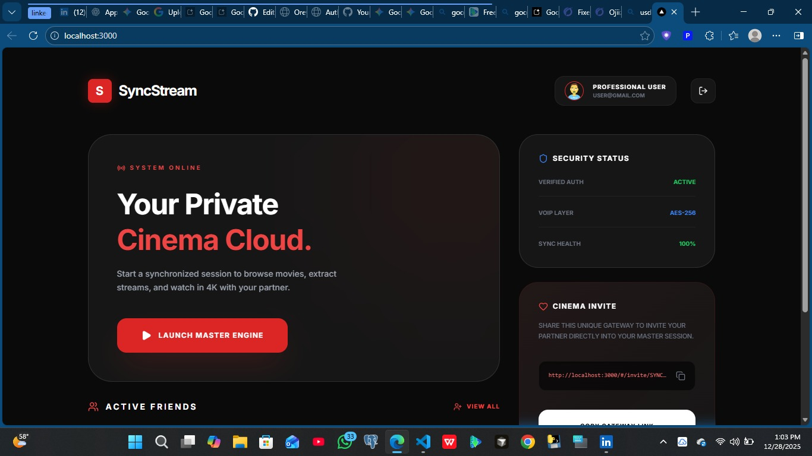

div align="center">
  

  <h1>🌌Orewa_Zenith live SYNCSTREAM</h1>
  
A High-End Creative room Engine

  
  

SyncStream: Real-Time Shared Cinema Experience
SyncStream is a high-performance, real-time video synchronization platform designed to bridge the gap in long-distance relationships. It allows users to browse any website, watch movies together, and communicate via live voice and chat—all perfectly in sync.

✨ Key Features
🎬 Universal Video Sync: Watch movies from any source (YouTube, Moviebox, etc.) with millisecond-perfect synchronization. If you pause, it pauses for everyone.

🌐 Integrated Social Browser: A built-in web browser with "Co-browsing" technology. Navigate the web together in real-time.

🎙️ Live Voice Overlay (WebRTC): High-quality voice chat with Audio Ducking (movie volume automatically lowers when you speak).

💬 Real-Time Chat: Floating chat interface for instant reactions while watching.

🔗 Deep Link Invitations: Create a private room and send a link to your partner to join instantly.

⚡ Low Latency Engine: Powered by Socket.io and WebRTC to ensure no lag between users.

🛠️ Tech Stack (Expert Level)
Frontend: Flutter / React Native (Cross-platform)

Backend: Node.js with Socket.io for real-time signaling.

Communication: WebRTC for Peer-to-Peer high-definition audio.

Injection Logic: Advanced JavaScript bridges for metadata and video URL extraction from third-party websites.

🚀 How It Works
Create a Room: Generate a unique session ID.

Invite: Share the room link with your partner.

Browse & Play: Use the in-app browser to find a movie. Our "Video Sniffer" detects the media source.

Sync: The app takes over the stream and syncs it across both devices instantly.

📌 Development Status
This project is currently in the Beta/MVP stage. We are continuously refining the "Video Injection" scripts to support more third-party streaming sites.